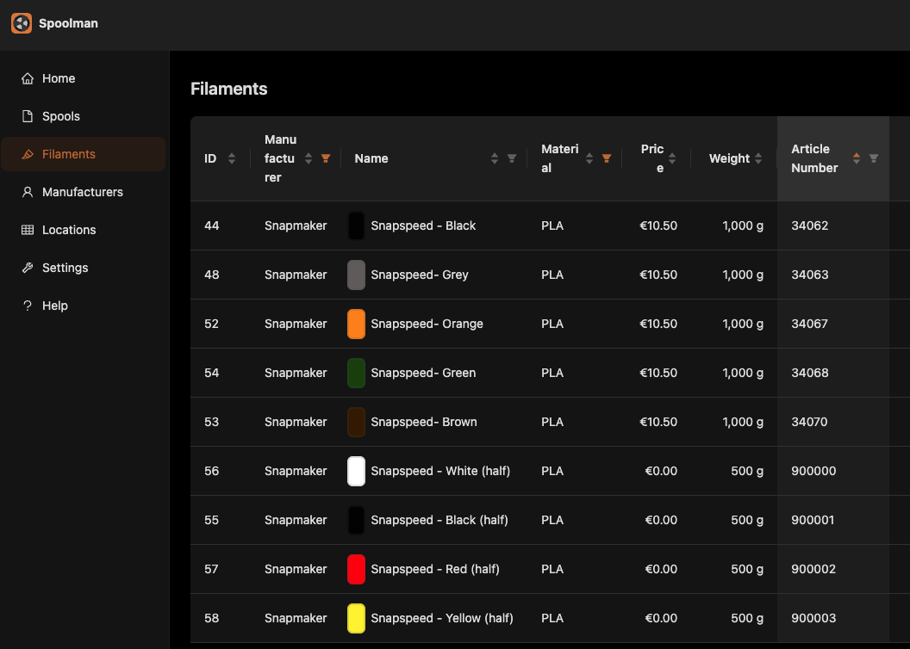
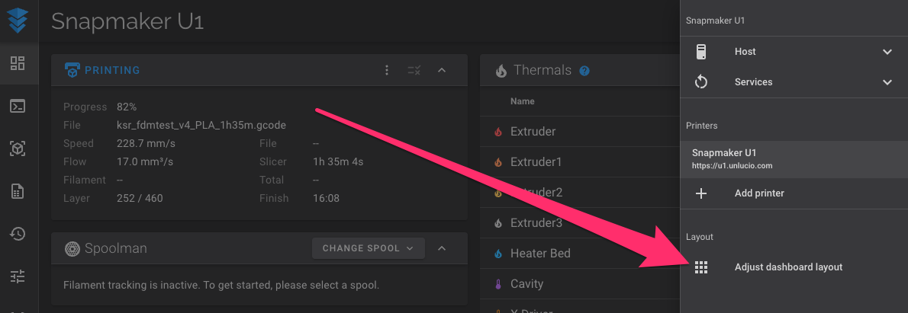
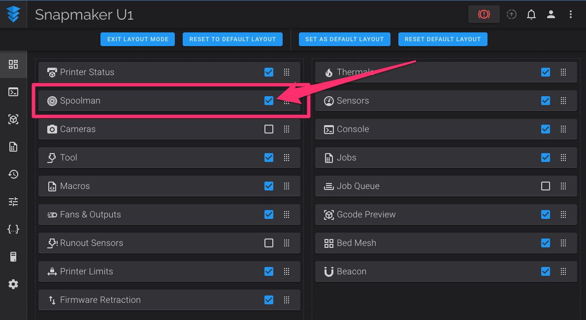

# Spoolman Bridge

Real-time tracking of your filament usage, with a bit of automation sprinkled in.
This is regular [Spoolman](https://github.com/Donkie/Spoolman) for the U1's multi-tool
system, wired up so the active spool follows the tool that is printing, with zero patches
to Klipper or Moonraker.

## What it does

- Detects RFID-tagged spools (via the RFID Spool Reader plugin) and sets the matching
  spool active when a tool is picked.
- Handles the U1's 32 virtual-tool system for jobs that need more than 4 filaments.
- Logs filament length used per print automatically.

## What it does not do

- It does not write tags.
- It does not invent `spool_id`s: a spool must already exist in your Spoolman instance.

## Requirements

### A working Spoolman instance

Spoolman is a web app. It does not run on the printer; host it elsewhere (a NAS, a Pi, a
home server). The easiest path is the official [Docker install](https://github.com/Donkie/Spoolman/wiki/Installation#docker-install);
a [standalone install](https://github.com/Donkie/Spoolman/wiki/Installation#standalone-install)
also works.

### Properly tagged spools

The bridge recognizes a spool by the `spool_id` on its tag. Snapmaker's own tags are
encrypted, so for those it falls back to the `SKU` and matches it against the
**Article Number** field of a filament in your Spoolman instance. Half-kilo and one-kilo
spools of the same color have different SKUs.

The SKU trick works with any tag the U1 can read that carries such a property.

## Setup

1. Install this plugin from the Bespok3d store. It pulls in the **RFID Spool Reader**
   automatically.
2. When prompted, enter your **Spoolman server address** (`host` or `host:port`; the port
   defaults to `7912` if you omit it). That is the only required setting.
3. The bridge starts syncing immediately; no config files to edit.

### Show the Spoolman panel in Fluidd

Open the **3-dot menu** on Fluidd's main page and choose **Adjust dashboard layout**.

Find the Spoolman panel and make sure it is enabled. Its position depends on how you have
arranged your dashboard, so look around for it.

## Macros and commands

These are added by the plugin and can be run from the Fluidd/Mainsail console or your
slicer:

- `SET_ACTIVE_SPOOL TOOL={0..3}` sets the selected tool as the active spool.
- `READ_FILAMENT_ID TOOL={0..3}` reads the selected lane's spool tag, if any.
- `GET_FILAMENT_ID TOOL={0..3}` prints the currently read tag for the selected lane.
- `CLEAR_ACTIVE_SPOOL` clears the current active spool.
- `CLEAR_ALL_SPOOLS` clears the selected spool for every tool.
- `DETECT_SPOOLS` re-detects the loaded spools. A handy reset when spool state looks wrong.
- `DUMP_SPOOLS` prints what the bridge knows about the loaded spools (detail depends on the
  log level).
- `SH_CONFIG MODE=<auto|manual> LOGS=<level>` changes the module's behavior at runtime
  without a restart.
- `SH_DEBUG [SKU=<sku>]` prints the current configuration; with a `SKU` it shows the spool
  that would be tracked for that SKU.

## Configuration

- **Spoolman server address** (required): where your Spoolman instance lives.
- **mode** (`auto` or `manual`): in `auto`, the RFID tag is the source of truth and falls
  back to a manually selected spool; in `manual`, the manual selection drives and tags are
  the fallback.
- **logging** (`error` < `info` < `warn` < `verbose` < `debug`): how chatty the logs are.

## Troubleshooting

- **Spool never goes active:** check the server address and that the printer can reach the
  Spoolman host and port.
- **No usage logged:** usage is recorded per print; confirm a spool is active before the
  print starts.
